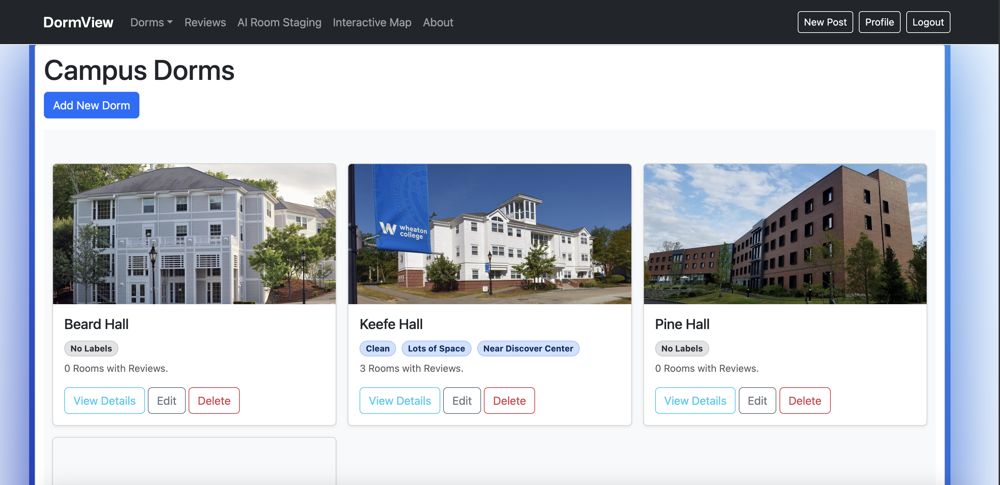

#     - DormView -

By Paedar Rader ('25) and Anton Lopez ('25)

## Introduction

Welcome to DormView, an interactive, vibrant overhaul to the way that Wheaton College students interact with their dorms and residential life on campus.

###### Description:

This program leverages Bootstrap and Django to create a web-platform that creates a virtual space for students, and residential staff, to explore residential halls and leave reviews on their rooms, creating a community that previously may not have existed.

###### Team Members / Contributers:

<ul><li>\\\\\\\\\\\\\\\\\\\\\\\\\\\\\\\\\\\\\\\\\\\\\\\\\\\\\\\\\\\\\\\\\\\\\\\\\\\\\\\\\\\\\\\\\\\\\\\\\\\\\\\\\\\\\\\\\\\\\\\\\\\\\\\\\\\\\\\\\\*\\\\\\\\\\\\\\\\\\\\\\\\\\\\\\\\\\\\\\\\\\\\\\\\\\\\\\\\\\\\\\\\\\\\\\\\\\\\\\\\\\\\\\\\\\\\\\\\\\\\\\\\\\\\\\\\\\\\\\\\\\\\\\\\\\\\\\\\\\*Anton Lopez\\\\\\\\\\\\\\\\\\\\\\\\\\\\\\\\\\\\\\\\\\\\\\\\\\\\\\\\\\\\\\\\\\\\\\\\\\\\\\\\\\\\\\\\\\\\\\\\\\\\\\\\\\\\\\\\\\\\\\\\\\\\\\\\\\\\\\\\\\*\\\\\\\\\\\\\\\\\\\\\\\\\\\\\\\\\\\\\\\\\\\\\\\\\\\\\\\\\\\\\\\\\\\\\\\\\\\\\\\\\\\\\\\\\\\\\\\\\\\\\\\\\\\\\\\\\\\\\\\\\\\\\\\\\\\\\\\\\\*<ul><li>Full Stack Engineer &amp; Cybersecurity Engineer</li><li>lopez\\\\\\\\\\\\\\\\\\\\\\\\\\\\\\\\\\\\\\\\\\\\\\\\\\\\\\\\\\\\\\\\\\\\\\\\\\\\\\\\\\\\\\\\\\\\\\\\\\\\\\\\\\\\\\\\\\\\\\\\\\\\\\\\\\\\\\\\\\\\\\\\\\\\\\\\\\\\\\\\\\\\\\\\\\\\\\\\\\\\\\\\\\\\\\\\\\\\\\\\\\\\\\\\_anton@wheatoncollege.edu</li></ul></li></ul><ul><li>\\\\\\\\\\\\\\\\\\\\\\\\\\\\\\\\\\\\\\\\\\\\\\\\\\\\\\\\\\\\\\\\\\\\\\\\\\\\\\\\\\\\\\\\\\\\\\\\\\\\\\\\\\\\\\\\\\\\\\\\\\\\\\\\\\\\\\\\\\*\\\\\\\\\\\\\\\\\\\\\\\\\\\\\\\\\\\\\\\\\\\\\\\\\\\\\\\\\\\\\\\\\\\\\\\\\\\\\\\\\\\\\\\\\\\\\\\\\\\\\\\\\\\\\\\\\\\\\\\\\\\\\\\\\\\\\\\\\\*Paedar Rader\\\\\\\\\\\\\\\\\\\\\\\\\\\\\\\\\\\\\\\\\\\\\\\\\\\\\\\\\\\\\\\\\\\\\\\\\\\\\\\\\\\\\\\\\\\\\\\\\\\\\\\\\\\\\\\\\\\\\\\\\\\\\\\\\\\\\\\\\\*\\\\\\\\\\\\\\\\\\\\\\\\\\\\\\\\\\\\\\\\\\\\\\\\\\\\\\\\\\\\\\\\\\\\\\\\\\\\\\\\\\\\\\\\\\\\\\\\\\\\\\\\\\\\\\\\\\\\\\\\\\\\\\\\\\\\\\\\\\*<ul><li>Full Stack Engineer &amp; Front End Designer</li><li>rader\\\\\\\\\\\\\\\\\\\\\\\\\\\\\\\\\\\\\\\\\\\\\\\\\\\\\\\\\\\\\\\\\\\\\\\\\\\\\\\\\\\\\\\\\\\\\\\\\\\\\\\\\\\\\\\\\\\\\\\\\\\\\\\\\\\\\\\\\\\\\\\\\\\\\\\\\\\\\\\\\\\\\\\\\\\\\\\\\\\\\\\\\\\\\\\\\\\\\\\\\\\\\\\\_paedar@wheatoncollege.edu</li></ul></li></ul>

#### Dependencies:

DormView requires various dependencies to run properly.

1. Python 3.13.3

```
Check Python Version:
python -V

Install Python:
via Python Website
```

2. Django

```
pip install django
```

3. PostgreSQL

```
pip install psycopg2
```

4. Bootstrap (via NPM)

```
npm install bootstrap
```

*Other Dependencies may involve additional Python Libraries*

### Installation / Compilation

1. When inside staging folder (in the same location as manage.py), please run the following command:

```
python3 manage.py runserver
```

**If you have all dependencies installed, this should boot up a locally hosted Django server on your computer. Using the terminal copy and paste the local address into your web browser of choice. The terminal/shell should look something like this:**

```
System check identified no issues (0 silenced).
-- Date / Time -- 
Django version 5.1.7, using settings 'staging.settings'
Starting development server at http://127.0.0.1:8000/
Quit the server with CONTROL-C.
```

If you copy and paste the '[http://127.0.0.1:8000/](http://127.0.0.1:8000/)' address into your browser, you should have a locally hosted DormView application. Please note that the database that populates locally differs from the official database; as the official one cannot be altered.



**Welcome to the DormView website. This page is under Dorms > All Dorms. Here you will see a list of all currently added dorms within the database.**

### Credits / History:

Django (Version 1.5) [Computer Software]. (2013). Retrieved from https://www.djangoproject.com/.

Bootstrap v5.0.2 (https://getbootstrap.com/)
Copyright 2011-2021 The Bootstrap Authors (https://github.com/twbs/bootstrap/graphs/contributors)
Licensed under MIT (https://github.com/twbs/bootstrap/blob/main/LICENSE)

### Troubleshooting / FAQ:

Currently, the RoomGPT platform exists separately from the DormView website. While initially this was going to be implemented in-house, the scope of the project wasn't able to match our early ambitions. Sign up for free through their website; do NOT give any credit card information to websites you haven't fully read the terms of service for. This site should not require any charges, or card. Additionally, the interactive map feature is through Wheaton's hosted map on their website.

* How Do I Submit a Review?
    * Make sure you are signed in with your Wheaton College email. Then, go to your profile and assign yourself to your room. Currently, Reslife can monitor the activity on your assigned room, so please enter the correct room. Then, under your dorm, you should be able to submit a review specifically for your room, and add pictures as you see fit.

* How Do I Change my Room?
    * Go through your profile, or change by contacting Reslife / Programming Team.

* How Do I Alter Dorm Information?
    * Currently, only Reslife or DormView admins can access the admin panel to alter information regarding dorms. If you want something changed, you can request said change via Reslife or DormView Admin Team.

* Why Aren't my Pictures Showing Up?
    * Please make sure your image files are standard to PNGs and JPEGs. Other Files, like HEIC, SVG... are not currently supported by DormView extensively. If you take a photo with your phone, please try and convert to a format that works.

* How Do I Edit my Review?
    * Go to your Dorm, and find your review. There should be an option to edit the posting on the dorm page, as well as your profile page.


### Version History
```
Initial Commit
Mar 24, 2025
    v v v
Multiple Image Functionality
Mar 31, 2025
    v v v
Fixed Issues with Room Change Logging
Apr 8, 2025
    v v v
Changed Paths and Added Homepage
Apr 9, 2025
    v v v
Reviews under rooms now link to post
Apr 14, 2025
    v v v
Adding Bootstrap, ROOMGPT folder, etc
Apr 22, 2025
    v v v
Update base.html + Style Changes
Apr 23 - 28, 2025
    v v v
Clean Files + Final Push
Apr 30, 2025
    v v v
Fix manage.py issue + Update models.py in review
May 6, 2025
    v v v
Future Changes Still in Progress
```